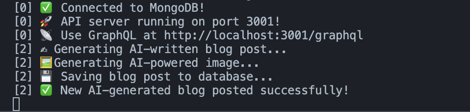
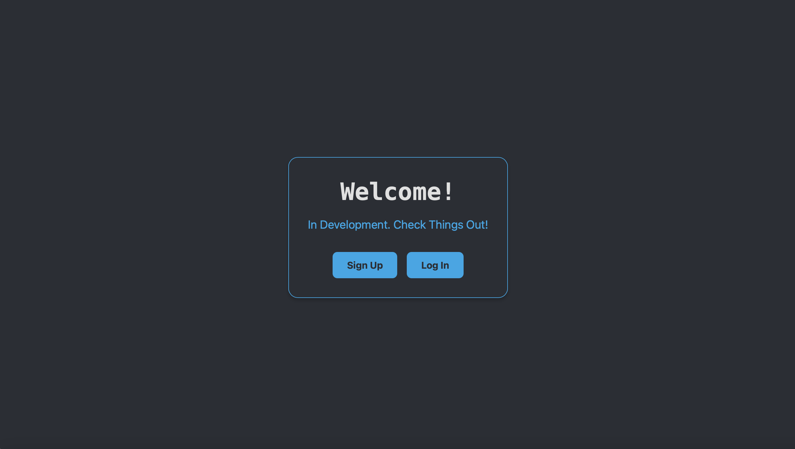
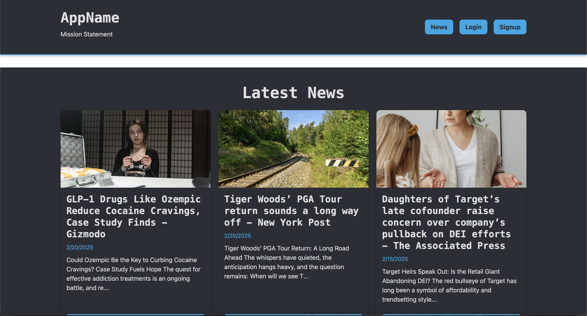

# **AI-Powered Auto Blog (MERN + GraphQL + AI Integration)**

## **Table of Contents**

1. [Overview](#overview)
2. [Concepts Covered](#concepts-covered)
3. [Learning Objectives](#learning-objectives)
4. [Technologies Used](#technologies-used)
5. [APIs Used](#apis-used)
6. [Features](#features)
7. [Setup and Installation](#setup-and-installation)
   - [Prerequisites](#prerequisites)
   - [Steps to Run Locally](#steps-to-run-locally)
8. [Summary](#summary)

---

## **Overview**

This **AI-Powered Auto Blog** system is a **MERN-stack** (MongoDB, Express.js, React, Node.js) web application with **GraphQL** API. The app integrates with **AI** for generating blog content, leveraging news APIs for topics and **Google Gemini** for article generation. Additionally, it allows users to sign up, verify their email, and interact with blog posts.

---

📸 **Screenshots:**

- **Blog Generation**  
  

- **Dashboard**  
  

- **Blog List Page**  
  

---

## **Concepts Covered**

### **1 - GraphQL API Integration**

- Utilizes **Apollo Server** and **Apollo Client** for building and consuming GraphQL APIs.
- Supports user authentication and CRUD operations for blog data.

### **2 - AI Integration**

- Fetches news data using APIs like **News API** for dynamic blog topics.
- Uses **Google Gemini** for generating **SEO-optimized articles** based on news topics.

### **3 - User Authentication**

- User sign-up, login, and email verification process powered by **JWT tokens**.
- Users can save blog posts to their profile.

### **4 - MongoDB Integration**

- **MongoDB** stores user and blog data.
- Blog posts are saved by users to their profiles, and blogs are fetched dynamically based on user interaction.

### **5 - Email Verification**

- **Nodemailer** is used for sending **email verification codes** to ensure **valid user sign-ups**.

---

## **Learning Objectives**

- Integrate **GraphQL API** for handling user authentication and blog data.
- Learn how to incorporate **AI** to generate content for dynamic blogs.
- Understand **MongoDB** integration for storing blog and user data.
- Implement **email verification** for users and prevent fake registrations.
- Implement **React state management** for seamless user interactions and real-time updates.

---

## **Technologies Used**

| Technology        | Purpose                                                             |
| ----------------- | ------------------------------------------------------------------- |
| **MongoDB**       | Database for storing user and blog data                             |
| **Express.js**    | Backend framework for API handling                                  |
| **React**         | Frontend UI for user interactions                                   |
| **Node.js**       | JavaScript runtime for backend logic                                |
| **GraphQL**       | Query language for flexible data fetching                           |
| **Apollo Server** | GraphQL server for API interactions                                 |
| **Apollo Client** | Client-side GraphQL for React                                       |
| **JWT**           | JSON Web Token for secure authentication                            |
| **Nodemailer**    | SMTP service for sending verification emails                        |
| **dotenv**        | Manages environment variables (.env)                                |
| **bcrypt**        | Hashes and secures user passwords                                   |
| **axios**         | HTTP client for fetching data from external APIs (News API, Pexels) |
| **Google Gemini** | AI-powered article generation                                       |

---

## **APIs Used**

1. **News API**

   - **API Key**: `Get Your API Key`
   - **Purpose**: Used to fetch trending topics from various categories like technology, health, sports, etc.

2. **Google Gemini API**

   - **API Key**: `Get Your API Key`
   - **Purpose**: Used to generate SEO-optimized blog posts based on fetched news topics.

3. **Pexels API**

   - **API Key**: `Get Your API Key`
   - **Purpose**: Used to fetch high-quality images for blog posts based on their titles.

4. **Nodemailer SMTP**
   - **Email User**: `Google`
   - **Email Password**: `App Passwords`
   - **Purpose**: Used to send verification emails to users during the sign-up process.

---

## **Features**

✅ **AI-Powered Blog Content Generation**  
✅ **Real-Time Blog Fetching and Display**  
✅ **User Signup with Email Verification**  
✅ **Save Blogs to User Profile**  
✅ **Pagination for Blog Posts**  
✅ **Generate SEO-Optimized Articles using Google Gemini**  
✅ **Fetch and Display News API for Dynamic Blog Topics**  
✅ **Responsive Frontend UI**  
✅ **Full `.env` Config Support for Deployment**  
✅ **Error Handling and User Notifications**

---

## **Setup and Installation**

### **Prerequisites**

- **Node.js** (v14 or later)
- **MongoDB** (local or Atlas instance)
- **Google Gemini API Key** (for article generation)
- **News API Key** (for fetching trending topics)
- **Pexels API Key** (for generating blog images)

---

### **Steps to Run Locally**

#### **1 - Install Backend Dependencies**

```sh
cd server
npm install
```

#### **2 - Install Frontend Dependencies**

```sh
cd ../client
npm install
```

#### **3 - Configure Environment Variables (`.env`)**

Create a **`.env`** file in the **`server`** directory and add:

```plaintext
MONGODB_URI=mongodb://127.0.0.1:27017/autoblog_app
JWT_SECRET=your_jwt_secret
PORT=3001

# Email Credentials (Use Gmail SMTP or another provider)
EMAIL_USER=your-email@gmail.com
EMAIL_PASS=your-email-app-password

# API Keys for external services
GOOGLE_GEMINI_API_KEY=your-google-gemini-api-key
NEWS_API_KEY=your-news-api-key
PEXELS_API_KEY=your-pexels-api-key
```

🚀 **For Gmail users**: Enable [App Passwords](https://myaccount.google.com/apppasswords) in your Google account.

#### **5️⃣ Start the Application**

```sh
npm run develop
```

The backend will run on **`http://localhost:3001/graphql`**  
The frontend will run on **`http://localhost:3000`**

---

## **Summary**

This **AI-Powered Auto Blog** combines **GraphQL, AI article generation, and dynamic blog fetching** to provide users with a powerful blog platform. Users can interact with AI-generated content, save blogs to their profile, and enjoy a seamless experience powered by **React** and **MongoDB**.

With **Apollo Client** and **GraphQL**, the app offers a flexible, modern solution for managing and generating content. The system is built on **best practices for secure user authentication** using **JWT tokens** and **Nodemailer** for email verification.

🚀 **You're ready to build more dynamic, AI-powered applications with GraphQL and modern JavaScript technologies!** 🎯
